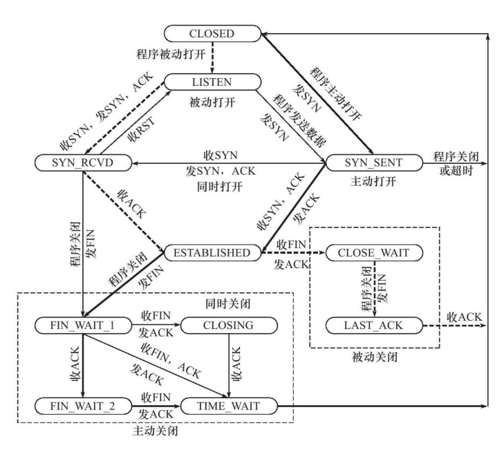

# 网络基础

## 1.TCP和UDP的区别及应用场景

- 区别
    1. 面向连接VS无连接
        - TCP建立一个连接需要3次握手IP数据包，断开连接需要4次握手。另外断开连接时发起方可能进入TIME_WAIT状态长达数分钟（视系统设置，windows一般为120秒），在此状态下连接（端口）无法被释放。
        - UDP不需要建立连接，可以直接发起。
    2. 可靠VS不可靠
        - TCP利用握手、ACK和重传机制，udp没有。
        - 校验和（校验数据是否损坏）；
        - 定时器（分组丢失则重传）；
        - 序列号（用于检测丢失的分组和重复的分组）；
        - 确认应答ACK（接收方告知发送方正确接收分组以及期望的下一个分组）；
        - 否定确认（接收方通知发送方未被正确接收的分组）；
        - 窗口和流水线（用于增加信道的吞吐量）。（窗口大小：无需等待确认应答而可以继续发送数据的最大值）
    3. 有序性
        TCP利用seq序列号对包进行排序，udp没有。
    4. 面向字节流vs面向报文
        - 面向报文
            面向报文的传输方式是应用层交给UDP多长的报文，UDP就照样发送，即一次发送一个报文。因此，应用程序必须选择合适大小的报文。若报文太长，则IP层需要分片。UDP对应用层交下来的报文，既不合并，也不拆分，而是保留这些报文的边界。这也就是说，应用层交给UDP多长的报文，UDP就照样发送，即一次发送一个报文。（一个upd的最大报文长度2^16-1-20-8,20是ip报文头，8是udp报文头）
        - 面向字节流
            面向字节流的话，虽然应用程序和TCP的交互是一次一个数据块（大小不等），但TCP把应用程序看成是一连串的无结构的字节流。TCP有一个缓冲，当应用程序传送的数据块太长，TCP就可以把它划分短一些再传送。如果应用程序一次只发送一个字节，TCP也可以等待积累有足够多的字节后再构成报文段发送出去。
    5. tcp有流量控制，udp没有
    6. tcp的头部比20bytes，udp8byres
- TCP应用场景：
效率要求相对低，但对准确性要求相对高的场景。因为传输中需要对数据确认、重发、排序等操作，相比之下效率没有UDP高。举几个例子：文件传输（准确高要求高、但是速度可以相对慢）、接受邮件、远程登录。

- UDP应用场景：
效率要求相对高，对准确性要求相对低的场景。举几个例子：QQ聊天、在线视频、网络语音电话（即时通讯，速度要求高，但是出现偶尔断续不是太大问题，并且此处完全不可以使用重发机制）、广播通信（广播、多播）。

## 2.大小端

- Little-Endian就是低位字节排放在内存的低地址端，高位字节排放在内存的高地址端。
- Big-Endian就是高位字节排放在内存的低地址端，低位字节排放在内存的高地址端。

    其中互联网使用的网络字节顺序采用大端模式进行编址，而主机字节顺序根据处理器的不同而不同，如PowerPC处理器使用大端模式，而Pentuim处理器使用小端模式。

    通过如下程序可以判断是否为大端（关键点在于判断超过一个字节的内容在内存中的存放顺序）。

    ```c
    BOOL IsBigEndian(){
        int a = 0x1234;
        char b =  *(char *)&a;  //通过将int强制类型转换成char单字节，通过判断起始存储位置。即等于 取b等于a的低地址部分
        if( b == 0x12)
        {
            return TRUE;
        }
        return FALSE;
    }
    ```

## 3.TCP的三次握手，为什么不是两次握手或是四次握手。断开连接如何操作，为什么要time-wait的时间


1. 第一次握手 客户端向服务端发送连接请求报文段。该报文段的头部中SYN=1，ACK=0，seq=x。请求发送后，客户端便进入SYN-SENT状态。
PS1：SYN=1，ACK=0表示该报文段为连接请求报文。
PS2：x为本次TCP通信的字节流的初始序号。 
TCP规定：SYN=1的报文段不能有数据部分，但要消耗掉一个序号。

2. 第二次握手 服务端收到连接请求报文段后，如果同意连接，则会发送一个应答：SYN=1，ACK=1，seq=y，ack=x+1。 该应答发送完成后便进入SYN-RCVD状态。
PS1：SYN=1，ACK=1表示该报文段为连接同意的应答报文。
PS2：seq=y表示服务端作为发送者时，发送字节流的初始序号。
PS3：ack=x+1表示服务端希望下一个数据报发送序号从x+1开始的字节。

3. 第三次握手 当客户端收到连接同意的应答后，还要向服务端发送一个确认报文段，表示：服务端发来的连接同意应答已经成功收到。 该报文段的头部为：ACK=1，seq=x+1，ack=y+1。 客户端发完这个报文段后便进入ESTABLISHED状态，服务端收到这个应答后也进入ESTABLISHED状态，此时连接的建立完成！
理论上讲不论握手多少次都不能确认一条信道是“可靠”的，但通过3次握手可以至少确认它是“可用”的，再往上加握手次数不过是提高“它是可用的”这个结论的可信程度。

- 为什么连接建立需要三次握手，而不是两次握手？ 
防止失效的连接请求报文段被服务端接收，从而产生错误。PS：失效的连接请求：若客户端向服务端发送的连接请求丢失，客户端等待应答超时后就会再次发送连接请求，此时，上一个连接请求就是『失效的』。
若建立连接只需两次握手，客户端并没有太大的变化，仍然需要获得服务端的应答后才进入ESTABLISHED状态，而服务端在收到连接请求后就进入ESTABLISHED状态。此时如果网络拥塞，客户端发送的连接请求迟迟到不了服务端，客户端便超时重发请求，如果服务端正确接收并确认应答，双方便开始通信，通信结束后释放连接。此时，如果那个失效的连接请求抵达了服务端，由于只有两次握手，服务端收到请求就会进入ESTABLISHED状态，等待发送数据或主动发送数据。但此时的客户端早已进入CLOSED状态，服务端将会一直等待下去，这样浪费服务端连接资源。


TCP连接是双向的，因此在四次挥手中，前两次挥手用于断开一个方向的连接，后两次挥手用于断开另一方向的连接。

1. 第一次挥手 若A认为数据发送完成，则它需要向B发送连接释放请求。该请求只有报文头，头中携带的主要参数为： FIN=1，seq=u。此时，A将进入FIN-WAIT-1状态。
PS1：FIN=1表示该报文段是一个连接释放请求。
PS2：seq=u，u-1是A向B发送的最后一个字节的序号。

2. 第二次挥手 B收到连接释放请求后，会通知相应的应用程序，告诉它A向B这个方向的连接已经释放。此时B进入CLOSE-WAIT状态，并向A发送连接释放的应答，其报文头包含： ACK=1，seq=v，ack=u+1。
PS1：ACK=1：除TCP连接请求报文段以外，TCP通信过程中所有数据报的ACK都为1，表示应答。
PS2：seq=v，v-1是B向A发送的最后一个字节的序号。
PS3：ack=u+1表示希望收到从第u+1个字节开始的报文段，并且已经成功接收了前u个字节。A收到该应答，进入FIN-WAIT-2状态，等待B发送连接释放请求。
第二次挥手完成后，A到B方向的连接已经释放，B不会再接收数据，A也不会再发送数据。但B到A方向的连接仍然存在，B可以继续向A发送数据。

3. 第三次挥手 当B向A发完所有数据后，向A发送连接释放请求，请求头：FIN=1，ACK=1，seq=w，ack=u+1。B便进入LAST-ACK状态。

4. 第四次挥手 A收到释放请求后，向B发送确认应答，此时A进入TIME-WAIT状态。该状态会持续2MSL时间，若该时间段内没有B的重发请求的话，就进入CLOSED状态，撤销TCB。当B收到确认应答后，也便进入CLOSED状态，撤销TCB。

- 为什么需要time_wait的时间：
这样可让TCP再次发送最后的ACK以防这个ACK丢失(另一端超时并重发最后的FIN)这种2MSL等待的另一个结果是这个TCP连接在2MSL等待期间，定义这个连接的插口(客户的IP地址和端口号，服务器的IP地址和端口号)不能再被使用。这个连接只能在2MSL结束后才能再被使用。

## 4.如果视频网站要传输视频，采用什么协议。udp丢包会导致花屏，有什么处理办法。

一提到流媒体传输、一谈到什么视频监控、视频会议、语音电话（VOIP），都离不开RTP协议的应用，但当大家都根据经验或者别人的应用而选择RTP协议的时候，你可曾想过，为什么我们要使用RTP来进行流媒体的传输呢？为什么我们一定要用RTP？难道TCP、UDP或者其他的网络协议不能达到我们的要求么？

    像TCP这样的可靠传输协议，通过超时和重传机制来保证传输数据流中的每一个bit的正确性，但这样会使得无论从协议的实现还是传输的过程都变得非常的复杂。而且，当传输过程中有数据丢失的时候，由于对数据丢失的检测（超时检测）和重传，会数据流的传输被迫暂停和延时。

    或许你会说，我们可以利用客户端构造一个足够大的缓冲区来保证显示的正常，这种方法对于从网络播放音视频来说是可以接受的，但是对于一些需要实时交互的场合（如视频聊天、视频会议等），如果这种缓冲超过了200ms，将会产生难以接受的实时性体验。
    为什么RTP可以解决上述时延问题

    RTP协议是一种基于UDP的传输协议，RTP本身并不能为按顺序传送数据包提供可靠的传送机制，也不提供流量控制或拥塞控制，它依靠RTCP提供这些服务。这样，对于那些丢失的数据包，不存在由于超时检测而带来的延时，同时，对于那些丢弃的包，也可以由上层根据其重要性来选择性的重传。比如，对于I帧、P帧、B帧数据，由于其重要性依次降低，故在网络状况不好的情况下，可以考虑在B帧丢失甚至P帧丢失的情况下不进行重传，这样，在客户端方面，虽然可能会有短暂的不清晰画面，但却保证了实时性的体验和要求。

传输视频协议三类：

- HTTP协议

    采用HTTP+MP4或是Http+flv。

    渐进式下载：渐进式下载是介于下载本地播放与实时流媒体之间的一种播放方式，下载本地播放必须将文件全部下载完成后才能下载，而渐进式下载不必等到全部下载完成后再播放，它可以一边下载一边播放，完成播放内容之后，整个文件会保存在计算机上。从播放的效果和用户体验上看，渐进式下载和实时流媒体是一样的，不同的是渐进式下载本地保留文件的副本，因此有人把它称为“伪流媒体”，即不是真正意思上的“流媒体”，此外，渐进式下载不能跳过某些数据包进行下载。

    原始的情况下无法快进或播放未下载的部分，通过range-request，可以请求偏移的数据。

    优点：自适应码率。客户端会根据网络自动选在不同码率的视频流，条件高的时候用高码率，否则用低码率。
    缺点：实时性相对较差，直播的时候延迟比较差。

- RTSP协议
  
  RTSP协议也是基于tcp的应用层协议，流媒体协议。其中的音视频流数据可以用TCP或者UDP来传输。

    一次基本的RTSP操作过程是:首先，客户端连接到流服务器并发送一个RTSP描述命令（DESCRIBE）。流服务器通过一个SDP描述来进行反馈，反馈信息包括流数量、媒体类型等信息。客户端再分析该SDP描述，并为会话中的每一个流发送一个RTSP建立命令(SETUP)，RTSP建立命令告诉服务器客户端用于接收媒体数据的端口。流媒体连接建立完成后，客户端发送一个播放命令(PLAY)，服务器就开始在UDP上传送媒体流（RTP包）到客户端。 在播放过程中客户端还可以向服务器发送命令来控制快进、快退和暂停等。最后，客户端可发送一个终止命令(TERADOWN)来结束流媒体会话

    1. TCP请求方式，此方式比较灵活，它不用另外建立音视频传输的Socket，而直接使用RTSP的Socket，这样做可以节省不少资源开支。由于采用TCP传输，数据的可靠性得到保障。在分析抓包数据可以看出客户端在SETUP请求时的数据交互中的Transport项指定了TCP传输方式RTP/AVP/TCP
    2. UDP请求方式，此方式需要多建立两个Socket，用于RTCP、RTP数据传送。分析抓包数据可以看出客户端在SETUP请求时的数据交互中Transport项指定了client_port=64790-64791，它是用来通知服务端与客户端建立Socket通信的。由此可见UDP方式，音视频数据传输与控制信号传输分开，这样导致系统性能开销增大，设计复杂，在嵌入式系统中比较少用。

    数据传输协议RTP，用于实时传输数据。该协议提供的信息包括：时间戳（用于同步）、序列号（用于丢包和重排序检测）、以及负载格式（用于说明数据的编码格式）。

    控制协议RTCP，用于QoS反馈和同步媒体流。相对于RTP来说，RTCP所占的带宽非常小，通常只有5%。

## 5.http协议1.0,1.1,2.1有什么异同

## 6.http协议有什么缺陷

## 7.使用http协议请求文件中的某一段该如何处理，请求的偏移量超过了文件大小会返回什么。

## 8.视频编码

## 9.如何判断网络拥塞

## 10.TCP流量控制

- 流量控制的方法：利用滑动窗口协议（连续ARQ协议）实现流量控制。在TCP报文头当中有一个16位大小的窗口大小子段rwnd，用来告知接收方发送方的缓冲区大小，单位是字节。

- 流量控制的目的：如果发送者发送数据过快，接收者来不及接收，那么就会有分组丢失。为了避免分组丢失，控制发送者的发送速度，使得接收者来得及接收，这就是流量控制。流量控制根本目的是防止分组丢失，它是构成TCP可靠性的一方面。

- 流量控制引发的死锁：当发送者收到了一个窗口为0的应答，发送者便停止发送，等待接收者的下一个应答。但是如果这个窗口不为0的应答在传输过程丢失，发送者一直等待下去，而接收者以为发送者已经收到该应答，等待接收新数据，这样双方就相互等待，从而产生死锁。

为了避免流量控制引发的死锁，TCP使用了持续计时器。每当发送者收到一个零窗口的应答后就启动该计时器。时间一到便主动发送报文询问接收者的窗口大小。若接收者仍然返回零窗口，则重置该计时器继续等待；若窗口不为0，则表示应答报文丢失了，此时重置发送窗口后开始发送，这样就避免了死锁的产生。

## 11.TCP拥塞控制

- 核心：拥塞窗口cwnd

- 慢开始算法：

1. 慢启动初始启动时设置拥塞窗口值（cwnd）为1、2、4或10个MSS。
2. 拥塞窗口在每接收到一个确认包时增加，每个RTT内成倍增加，当然实际上并不完全是指数增长，因为接收方会延迟发送确认，通常是每接收两个分段则发送一次确认包。
3. 发送速率随着慢启动的进行而增加，直到遇到出现丢失、达到慢启动阈值（ssthresh）、或者接收方的接收窗口进行限制。
    - 如果发生丢失，则TCP推断网络出现了拥塞，会试图采取措施来降低网络负载。这些是靠具体使用的TCP拥塞算法来进行测量判断。
    - 当达到慢启动阈值（ssthresh）时，慢启动算法就会转换为线性增长的阶段，算法控制每个RTT内拥塞窗口只增加1个分段量。

4. 对于处理报文丢失这个事件上，不同拥塞控制算法表现有所不同：
    - TCP Tahoe
    对于TCP Tahoe算法，当发生丢失时，会进入“快速重传”机制，慢启动阈值设为之前拥塞窗口值的一半，拥塞窗口值降为初始值，重新进入慢启动阶段。当拥塞窗口值达到慢启动阈值时，每RTT内拥塞窗口增加值则为“MSS除以CWND”的值，所以拥塞窗口按线性速度增加。
    - TCP Reno
    TCP Reno算法实现了一个名为“快速恢复”的机制，慢启动阈值设为之前拥塞窗口值的一半，和作为新的拥塞窗口值，并跳过慢启动阶段，直接进入拥塞控制阶段。

    慢启动假设分段的未确认是由于网络拥塞造成的，虽然大部分网络的确如此，但也有其他原因，例如一些链路质量差的网络，会导致分段包丢失。在一些网络环境，例如无线网络，慢启动效率并不好。慢启动对于一些短暂的连接性能并不好，一些较旧的网页浏览器会创建大量连续的短暂链接，通过快速开启和关闭链接来请求获得文件，这使得大多数链接处于慢启动模式，导致网页响应时间差。所以现在新的网页浏览器，会通过向特殊的服务器，开启一条链接来请求获得全部的文件，而避免频繁新建大量短暂链接。不过这样对一些非请求网站所提供的服务，例如广告跟踪脚本、社交分享功能脚本、网络分析脚本等，并不适用。

- 快速重传
快速重传（Fast retransmit）是对TCP发送方降低等待重发丢失分段用时的一种改进。TCP发送方在每发送一个分段时会启动一个超时计时器，如果相应的分段确认没在特定时间内被送回，发送方就假设这个分段在网络上丢失了，需要重发。这也是TCP用来估计RTT的测量方法。

重复确认（duplicate cumulative acknowledgements，DupAcks）就是这个阶段的基础，其基于以下过程：如果接收方接收到一个数据分段，就会将该分段的序列号加上数据字节长的值，作为分段确认的确认号，发送回发送方，表示期望发送方发送下一个序列号的分段。但是如果接收方提前收到更下一个序列号的分段——或者说接收到无序到达的分段，即之前期望确认号对应的分段出现接收丢失——接收方需要立即使用之前的确认号发送分段确认。此时如果发送方收到接收方相同确认号的分段确认超过1次，并且该对应序列号的分段超时计时器仍没超时的话，则这就是出现重复确认，需要进入快速重传。

快送重传就是基于以下机制：如果假设重复阈值为3，当发送方收到4次相同确认号的分段确认（第1次收到确认期望序列号，加3次重复的期望序列号确认）时，则可以认为继续发送更高序列号的分段将会被接受方丢弃，而且会无法有序送达。发送方应该忽略超时计时器的等待重发，立即重发重复分段确认中确认号对应序列号的分段。

## 12.UDP数据报最大长度

链路层的MTU(最大传输单元)大小为1500字节，IP数据报首部20字节，UDP数据报首部8字节，所以UDP数据报的数据最大长度是1472字节。

## 13.tcp的可靠性

1. 确认和重传机制

    - 建立连接时三次握手同步双方的“序列号 + 确认号 + 窗口大小信息”，是确认重传、流控的基础
    - 传输过程中，如果Checksum校验失败、丢包或延时，发送端重传

2. 数据排序

    TCP有专门的序列号SN字段，可提供数据re-order

3. 流量控制

    窗口和计时器的使用。TCP窗口中会指明双方能够发送接收的最大数据量

4. 拥塞控制

    TCP的拥塞控制由4个核心算法组成。

    - “慢启动”（Slow Start）
    - “拥塞避免”（Congestion avoidance）
    - “快速重传 ”（Fast Retransmit）
    - “快速恢复”（Fast Recovery）

## 14.XSS攻击

XSS又称CSS，全称Cross SiteScript，跨站脚本攻击，是Web程序中常见的漏洞，XSS属于被动式且用于客户端的攻击方式，所以容易被忽略其危害性。其原理是攻击者向有XSS漏洞的网站中输入(传入)恶意的HTML代码，当其它用户浏览该网站时，这段HTML代码会自动执行，从而达到攻击的目的。如，盗取用户Cookie、破坏页面结构、重定向到其它网站等。

- DOM Based XSS
DOM Based XSS是一种基于网页DOM结构的攻击，该攻击特点是中招的人是少数人。可以通过发送给别人带有恶意代码的连接，其他人访问该链接时就会自动执行我的恶意代码，从而实现信息的泄露。

- Stored XSS

攻击者将恶意代码提交到目标网站的数据库中。
用户打开目标网站时，网站服务端将恶意代码从数据库取出，拼接在 HTML 中返回给浏览器。
用户浏览器接收到响应后解析执行，混在其中的恶意代码也被执行。
恶意代码窃取用户数据并发送到攻击者的网站，或者冒充用户的行为，调用目标网站接口执行攻击者指定的操作。

输入检测
定长控制

## 15.DDos攻击

拒绝服务攻击（英语：denial-of-service attack，简称D+oS攻击）亦称洪水攻击，是一种网络攻击手法，其目的在于使目标计算机的网络或系统资源耗尽，使服务暂时中断或停止，导致其正常用户无法访问。

## TCP/IP 详解笔记

## 第十二章TCP传输控制协议

ARQ：automatic Repeat Request，自动重复请求。当通信出错时简单的尝试重新发送，只到信息最终被接收。

### TCP提供一种可靠、面向连接，字节流。传输层的服务。可以被描述为“一种带累计正向确认的滑动窗口协议”

- 面向连接是指使用TCO的两个应用程序必须在他们可交换数据之前，通过相互连接来简历一个TCP连接。像广播和组播的概念在TCP中都是不存在的。
- 字节流服务指的是TCP提供一种字节流抽象概念给应用程序使用，这种设计方案的结果是，没有由TCP自动插入的记录表之或消息边界。在TCP的一端写入10字节，在写入20字节，在写入50字节，TCP的另一端是完全不知道的。TCP把应用程序的字节流转换为一组IP可以携带的分组，这些分组包含序列号，序列号在TCP中代表了每个分组的第一个字节在整个数据流的字节偏移。这允许分组在传送过程中是可变大小的，同时运行他们组合。

### TCP的可靠性：

1. TCP维持了一个强制的校验和。
2. TCP发送一组报文段时，他通常设置一个重传计时器，等待对方接收确认。
3. TCP接收到连接的另一端的数据时，他会发送一个确认（ACK）。TCP的ACK是累积的，即表示为N的ACk暗示了直到N的字节已经被成功接收了。
4. TCP提供一种双工服务。
5. 使用序列号。一个TCP接收端可丢弃重复的报文段和记录以杂乱次序到达的报文段。

### TCP头部


TCP头部标准长度为20字节，绿色部分用于与发送方关联的相反方向的数据流。

## 第十三章TCP连接管理

### TCP连接的简历与终止


注意：

1. tcp关闭连接时的序列号是不变的。
2. 关闭操作一般是由应用程序提出关闭请求而引发的( 如操作系统的close() )
3. FIN也需要ACK，如果FIN丢失，则发送方会重传该报文，直到接收到ACK为止。
4. TCP支持半关闭状态，(通过shudown() 代替 close() ),半关闭表明：我的数据发送已经结束，但我仍希望接收来自的对方的数据，直到对方发送FIN给我。

#### TCP的初始序列号

在发送用于简历连接的SYN之前，通信双方会选择一个初始序列号，初始序列号会随时间改变。这是为了抵御以下两种情况：

1. 如果连接由某个报文段的长时间延迟而关闭，然后又以相同的四元组(IP1+Port1+IP2+Port2)被重新打开，此时延迟的报文抵达了，那么他又会被认为是合法的而进入到数据流当中。
2. 以1方式伪造数据发送。
现代操作系统通过半随机的方式进行初始序列号的选择。  

#### 连接建立超时

系统可以配置发送的初始SYN的数目，但通常会选择一个较小的数5.当超过最大次数时，则认为失败。
发送SYN的时机存在指数回退机制，即发送间隔会随次数指数增长，如发送时间为0,3(3),9(6),21(12),45(24),49(48)

### TCP选项

1. 最大段大小选项
   最大段大小是指TCP协议所允许的最大报文段，默认值为536字节。(任何主机都能处理至少576字节(20(ip头)+20(tcp header)+536=576)).
   最大段大小是通信的一方的明确表示，它不希望有大于改大小的报文。
2. 选择确认选项
   在接收到乱序的报文时，通过提供SACK来描述该乱序。
3. 窗口缩放选项
   提供一个比例因子，使窗口大小的值在原有的头部提供的数值的基础上扩大2的s次方倍，(s不超过14)。
   该选项只能出现在SYN报文段，并且双方都包含才会生效。
4. 时间戳选项与防回绕序列号
   发送方在发送报文段时把当前时钟的时间值放入时间戳字段，接收方在确认该报文段时把`时间戳`字段值复制到`时间戳回显重试`字段。因此，发送方在收到确认报文后，可以准确计算出RTT。
   时间戳选项可以提供：
   - 方便计算RTT
   - tcp序号仅有2^32个，耗尽后就会重新开始，此时可以通过时间戳来判定哪一个报文是较为新的报文，防回绕算法会把序列号相同，但是时间旧的丢弃。
5. 用户超时选项
   超时选项表示TCP发送者在确认对方未能成功接收数据之前愿意等待的ACK确认时间。这是建议性质的，因为关闭连接是由对方发起的，这并不能由发送方决定。
   建议(设置过长会浪费资源，过短会使得连接过早断开，建议值可以通过API修改)
   - TCP连接达到三次重传阈值时应当通知应用程序
   - 超时大于100秒则应该关闭连接。
6. 认证选项
   通过提供加密散列算法来认证报文段。

### TCP状态转换



- TIME_WAIT状态

  TIME_WAIT状态也称为2MSL等待状态。在该状态下，TCP将会等待两倍于最大段生存期MSL(maximum Segment Lifetime).MSL是任何TCP实现的必要内容，他的数值是可以通过API修改的。
  TCP执行一个主动关闭并发送最终的ACK时，连接必须处于TIME_WAIT状态，并持续两倍于最大生存期的时间。
  1. 可靠地实现TCP全双工连接的终止
   (防止最终的FIN丢失)TCP协议在关闭连接的四次握手过程中，最终的ACK是由主动关闭连接的一端（后面统称A端）发出的，如果这个ACK丢失，对方（后面统称B端）将重发出最终的FIN，因此A端必须维护状态信息（TIME_WAIT）允许它重发最终的ACK。如果A端不维持TIME_WAIT状态，而是处于CLOSED 状态，那么A端将响应RST分节，B端收到后将此分节解释成一个错误（在java中会抛出connection reset的SocketException)。因而，要实现TCP全双工连接的正常终止，必须处理终止过程中四个分节任何一个分节的丢失情况，主动关闭连接的A端必须维持TIME_WAIT状态 。

  2. 允许老的重复分节在网络中消逝 
   (防止老的分组在断开连接后立即重新建立连接重新进入流中)TCP分节可能由于路由器异常而“迷途”，在迷途期间，TCP发送端可能因确认超时而重发这个分节，迷途的分节在路由器修复后也会被送到最终目的地，这个迟到的迷途分节到达时可能会引起问题。在关闭“前一个连接”之后，马上又重新建立起一个相同的IP和端口之间的“新连接”，“前一个连接”的迷途重复分组在“前一个连接”终止后到达，而被“新连接”收到了。为了避免这个情况，TCP协议不允许处于TIME_WAIT状态的连接启动一个新的可用连接，因为TIME_WAIT状态持续2MSL，就可以保证当成功建立一个新TCP连接的时候，来自旧连接重复分组已经在网络中消逝。、
  
- FIN_WAIT_2

  在一方已经发送了FIN并接受到对应的ACK后，他进入了TIME_WAIT_2状态，对方进入CLOSE_WAIT状态，如果对方不发送FIN，CLOSE_WAIT状态将会一直持续下去。
  解决：主动关闭者知道这是一个完全关闭而不是半关闭，他就会设置一个计时器，计时器超时时连接仍是空闲的，TCP就进入CLOSED状态。

### 重置报文段

TCP的RST字段称为"重置报文段"。

1. 针对不存在的端口连接请求
   当一个数据报到达一个不能说会用的目的端口时就会生成一个ICMP目的地不可达消息。TCP协议使用重置报文段来完成相关的工作。(由目标主机向源主机发送重置报文段)

2. 终止一条连接
   在任何时刻都可以通过发送一个终止报文段来提到FIN终止一条连接。
   - 此时所有排队的数据都会被排气，重置报文段直接被抛弃。
   - 重置报端的接收方会说明通信的另一端采用了终止的方式而不是一次正常的关闭。API会提供一种实现圣湖中心行为的方式来取代正常的关闭操作

3. 半开连接(强行断开网络或电源，会产生半开连接)
   在未告知另一端的情况下通信的一端关闭或终止连接，此时TCP处于半开状态。不通过半开连接传输数据，正常的一方不会知道另一端已经崩溃。此时重启机器，重启的机器接收到消息发现自己并不知道这样一条连接，于是发送一条重置报文段，此时双方断开连接。

4. 时间等待错误
   在TIME_WAIT状态下，接收到一条在网络中呆了很久的报文（合法，可能是重发的报文又抵达了），此时会回复一个ACK给对方，但是对方已经进入CLOSED状态，它并不知道存在这样一条连接，它会发送一条重置报文段给对方，强制断开了连接，但是这是不必要的。这会使得对方过早的从TIME_WAIT状态进入到CLOSED状态。

   很多系统归档TIME_WAIT状态不响应重置报文段。

### 与TCP相关的攻击

1. SYN泛洪
   大量发送SYN报文，但是不响应对方的SYN，使得对方处于半连接，对方超时重传ACK，更加剧了负担。

## 第十四章TCP超时与重传

重传机制有两类：超时重传和快速重传。

TCP有两个阈值来控制如何重传同一个报文段(R1至少为3次，R2至少为100s):

- R1：TCP在向IP层传递消极建议(如重新评估当前当前的IP路径)前愿意尝试的重传次数(或等待时间)。注意此处重传会有指数回退。
- R2：TCP放弃当前连接的时机。

### 设置RTO(重传超时：发送数据包，启动重传定时器，重传定时器到期所花费的时间)

TCP超时和重传的基础是如何根据给定连接的RTT设置RTO。若TCP先于RTO开始重传(判定过紧，过度重传)，可能会在网络中引起不必要的数据，反之，若RTO远大于RTT，网络利用率会下降(判定过松，缺乏重传)。

1. 计算RTO的经典方法(低通过滤器)
   α一般设置为0.8-0.9，估计值主要现存值影响。这种方法在RTT相对稳定的网络中性能较好，在RTT变化大的网络中效果显然较差。

   srtt = α*srtt+(1 - α)* M  (srtt 为 RTT 估计值，M为本次的RTT样本值)
   RTO = min(ubound, max(lbound,β*srtt)) (ubound为RTO上界，lbound为RTO下界)

2. 标准方法
   标准方法通过引入平均偏差来引入RTT变化较大时的波动性。使RTO受RTT变化的影响更大。
   srtt=(1-α)*srtt + α*M
   rttvar=(1-h)*rttvar + h(|M-srtt|)
   RTO = srtt + 4*rttvar
   一些改进方法：
   - 设置上下界
   - 采用 srtt = M,rttvar = M/2设置初始值
   - RTT测量会受到重传的影响。假设第一个包的传输出现超时，该数据包会被重传，接着收到一个ACK，此ACK是对哪一个发送就存在二义性。仅当接收到未经重传的数据时，此srtt采用于计算RTO,避免二义性(karn算法的一部分）。
   - 带时间戳的RTT测量
3. linux方法
   Linux的时钟粒度为1ms。

### 基于计时器的重传

一旦TCP发送端得到了基于时间变化的RTT测量值就可以设定RTO。在设定计时器之前，需记录被及时的报文段序列号，若及时收到了该报文的ACK，那么计时器被取消。之后否发送端每发送一个数据包都设定一个新的计时器，并记录序列号。

在连接设定的RTO内，TCP没有收到被及时的报文段的ACK，就会触发超时重传。此时它会降低当前数据发送率进行快速响应。有两种方法

- 基于拥塞控制机制减小发送窗口大小
- 每当以重传报文段再次被重传时，增大RTO的退避因子。

### 快速重传

TCP发送端在观测到至少dupthresh个重复的ACK后，立即重传可能丢失的分组，不必等待重传计时器超时。

快速重传机制基于接收端的反馈信息来进发重传而不是依赖重传计时器。当失序报文到达时，重复的ACK应当立即返回，不能进行延迟发送。重复的ACK达到发送端说明先前发送的某个分组丢失了(期盼的分组未抵达因此ACK还是原先期盼的ACK)。TCP会等待一定数目的重复ACK来决定是否触发快速重传，一般是3次。

TCP接收到徐来好等于或大于的**恢复点(发送端在执行重传前已经发送的最大序列号)**的ACK是，才会从重传中恢复。